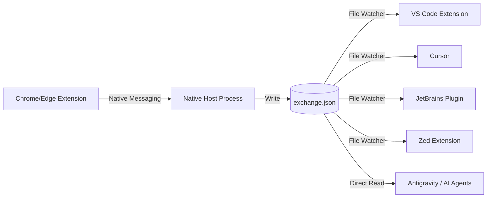

# IDE Support Analysis & Roadmap: BridgeContext

This document analyzes the feasibility and path forward for supporting popular IDEs beyond VS Code.

## 🌉 The "Universal Bridge" Architecture

The current BridgeContext architecture is uniquely suited for multi-IDE support because it uses a **FileSystem-based IPC (Inter-Process Communication)**.

### Advantages of this Architecture:
*   **Zero Network Ports**: No local server required, avoiding firewall/antivirus issues.
*   **Privacy-First**: Communication happens at the OS level (Local FS).
*   **Language Agnostic**: Every IDE extension platform (Node, Java, Python, Rust, Lua) can read and watch a JSON file.

---

## 🏗️ Support Roadmap

### 1. Cursor (Priority: High)
**Status**: ✅ Supported (Verified)
**Details**: Verified. The VS Code extension works natively in Cursor.
**Action Items**:
- [x] Add "Cursor" to the list of supported editors in README. [x]
- [x] Verify injection into Cursor's AI sidebar. [x]

### 2. JetBrains Suite (Priority: High)
*Includes: IntelliJ, WebStorm, PyCharm, CLion, GoLand, etc.*
**Status**: ✅ Supported (Hardened)
**Implementation**:
- **JCEF Webview**: Reuses the core HTML logic with a secure, hardened UI bridge.
- **Native Watcher**: High-performance background file watcher implemented in Kotlin.
- **Status**: Production-ready in `jetbrains-extension/`.

### 3. Zed (Priority: Medium)
**Status**: 🚧 Emerging
**Challenge**: Zed does not yet have a stable Webview API for extensions.
**Implementation Strategy**:
- **Native Implementation**: Build a UI using Zed's `gpui` crate (Rust).
- **MCP Integration**: Explore making BridgeContext an **MCP (Model Context Protocol)** server. Zed is heavily investing in MCP, which might allow context to be "discovered" by Zed's built-in AI assistant rather than just being a sidebar.

### 4. Antigravity IDE & Agentic Assistants (Priority: 🔥 Essential)
**Status**: ✅ Native Support (via MCP)
**Implementation Strategy**:
- **MCP Native**: Antigravity IDE is "agent-first" and natively supports the **Model Context Protocol (MCP)**.
- **Workflow**: By adding the `mcp-server.js` to Antigravity IDE, the agent can autonomously query the current BridgeContext research. 
- **Direct Context Awareness**: Beyond the MCP server, Antigravity agents can also read `exchange.json` directly as a local file, providing two layers of integration.

### 5. Neovim / Vim (Priority: Medium)
**Status**: ✅ Supported (Stable)
**Implementation**:
- **Lua Plugin**: High-performance watcher using `uv.new_fs_event`.
- **UI**: Floating window (`BridgeContext`) and direct injection (`BridgeInject`).
- **Status**: Production-ready in `neovim-extension/`.

---

## 🚀 Immediate Next Steps

1.  **Verify Cursor**: Explicitly test and document Cursor support.
2.  **JetBrains Prototype**: Initialize a JetBrains plugin project using the IntelliJ SDK and JCEF.
3.  **Documentation Update**: Update the README to reflect the "Multi-IDE" vision.

> [!TIP]
> Since JetBrains and VS Code cover ~90% of the professional market, focusing on a high-quality JetBrains plugin after VS Code is the most strategic move.
